# JS

## Var let const 的区别

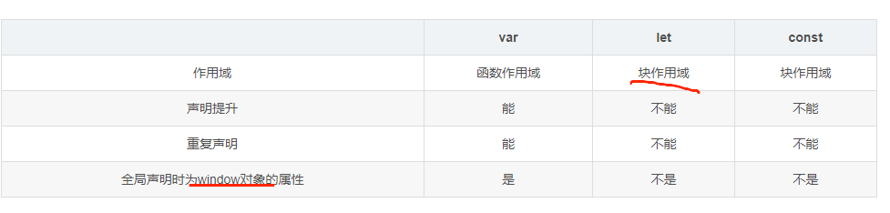

const关键字定义的常量，声明时必须进行初始化，且初始化后不可再修改。

局部变量在函数调用完消失，全局在页面关闭消失

## undefined 和 null的区别

undefined :声明了未赋值；null:空值

## Promise:避免回调异步

1、Promise对象的状态不受外界影响

1）pending 初始状态

2）fulfilled 成功状态

3）rejected 失败状态

Promise 有以上三种状态，只有异步操作的结果可以决定当前是哪一种状态，其他任何操作都无法改变这个状态

2、Promise的状态一旦改变，就不会再变，任何时候都可以得到这个结果，状态不可以逆，只能由 pending变成fulfilled或者由pending变成rejected

3、Promise的三个缺点
1）无法取消Promise,一旦新建它就会立即执行，无法中途取消
2）如果不设置回调函数，Promise内部抛出的错误，不会反映到外部
3）当处于pending状态时，无法得知目前进展到哪一个阶段，是刚刚开始还是即将完成

4、Promise在哪存放成功回调序列和失败回调序列？
1）onResolvedCallbacks 成功后要执行的回调序列 是一个数组

2）onRejectedCallbacks 失败后要执行的回调序列 是一个数组

以上两个数组存放在Promise 创建实例时给Promise这个类传的函数中，默认都是空数组。
每次实例then的时候 传入 onFulfilled 成功回调 onRejected 失败回调，如果此时的状态是pending 则将onFulfilled和onRejected push到对应的成功回调序列数组和失败回调序列数组中，如果此时的状态是fulfilled 则onFulfilled立即执行，如果此时的状态是rejected则onRejected立即执行

上述序列中的回调函数执行的时候 是有顺序的，即按照顺序依次执行

## Map，WeakMap,Object

WeakMap键名弱引用，map为了解决object中key必须是字符串，Map的键可以为Number，对象Object，数组Array，方法Function等。Map还有个优点是具有极快的查找速度。

## JS作用域

**在 JavaScript 中, 作用域为可访问变量，对象，函数的集合。**

全局，局部，window

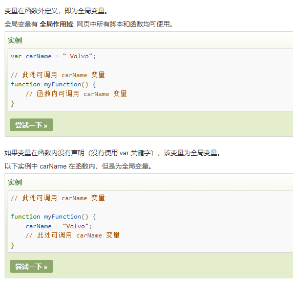

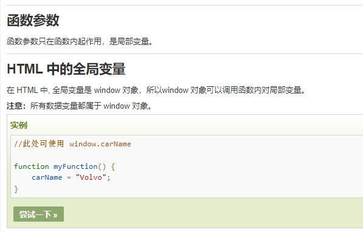

## === 与==

===为绝对相等，即数据类型与值都必须相等。

## 类型转化

tostring();parseInt()

## some、every和find

some它对数组中的每一项进行校验，只要有一项通过了就是`true`,可以用于判断输入框有无值

every它对数组中的每一项进行校验，只要有一项不通过它就是`false，可以用于判断输入框有无空格值`

find()和上面两个不一样，它返回的是值，而且是第一个满足条件的值，则返回 `undefined`

## 原生js如何获取页面上的节点

- document.getElementById()
- document.getElementByClassName()
- document.getElementsByTagName（）
- document.querySelector()

## 继承

1.原型继承，将父类实例作为子类的原型 2.构造继承（call）,只是复制了属性与方法，不能继承原型 3.拷贝继承，把原型拷贝。4.组合继承

## call、apply、bind

动态修改this

## reduce

数组的reduce()方法应用场景:下次操作的初始值，依赖于上次操作的返回值。1．数值的累加计算2链式获取对象属性的值

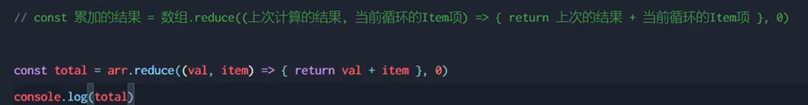

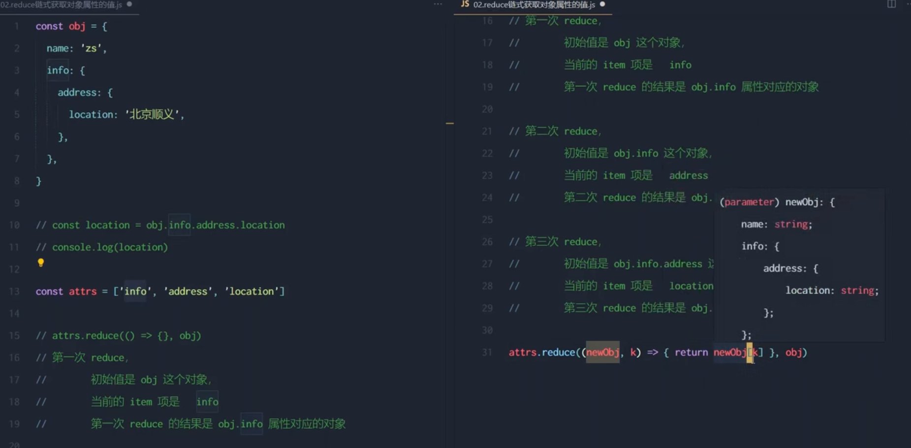

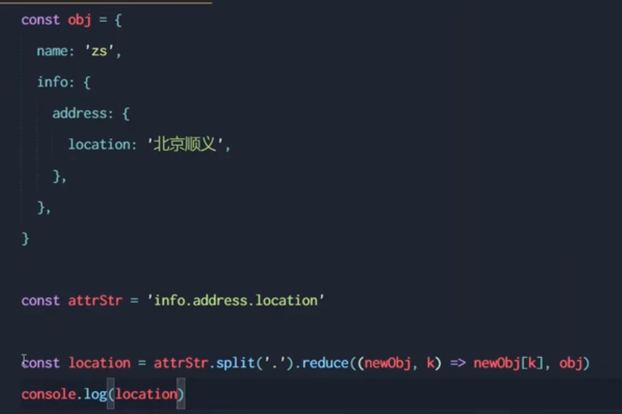

## async/awai,generator

用同步方式，执行异步操作,generator实现了[协程](https://so.csdn.net/so/search?q=协程&spm=1001.2101.3001.7020)，一个进程有多个线程，一个线程有多个协程，但是一个线程只能有一个协程在运行，如果当前协程可以执行，就执行它，否则就将它挂起，然后去执行其他协程，等这个协程结果返回可以继续执行时再来执行它

# vue

## vue2 VS vue3

1. vue2和vue3双向数据绑定原理发生了改变, 
   1. Vue2：API Object.definePropert()对数据进行劫持 + 发布订阅模式的方式来实现,
   2. Vue3：使用了 [es6](https://so.csdn.net/so/search?q=es6&spm=1001.2101.3001.7020) 的 ProxyAPI 对数据代理.
2. Vue3支持碎片.
3. vue2使用选项类型API, vue3合成型API。
4. vue2数据放入data，vue2用setup。
5. vue3 Teleport瞬移组件。
6. 父子传参不同.
7. 生命周期钩子

## 钩子函数(生命周期)

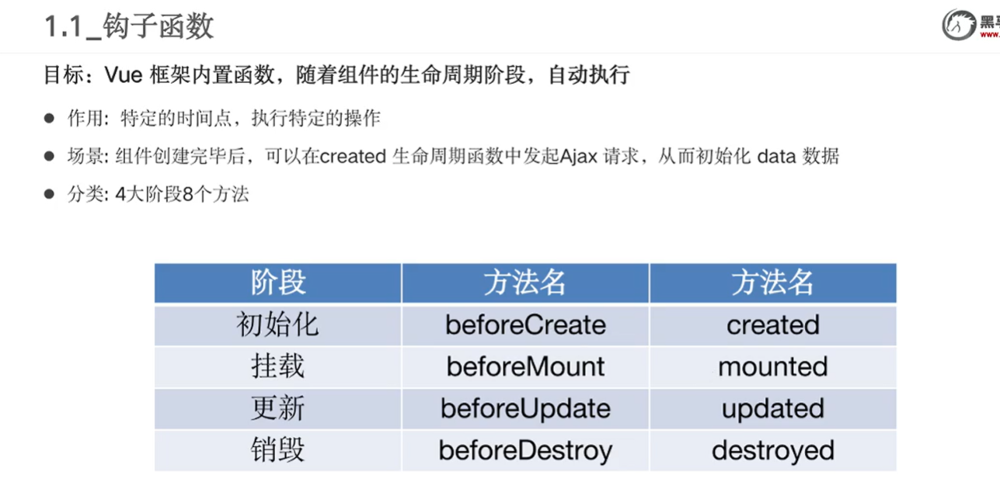

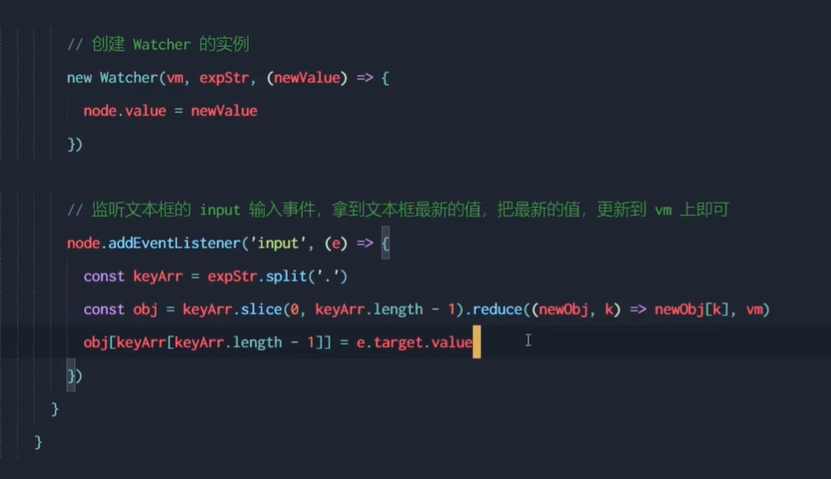

## 双向绑定原理

1. 第一步，“数据劫持”：vue 2.x 用 Object.defineProperty() 方法来实现数据劫持，为每个属性分配一个订阅者集合的管理数组 dep；vue 3.x 用 ES6 的 Proxy 构造函数来实现数据劫持。
2. 第二步，“添加订阅者”：在编译的时候在该属性的数组 dep 中添加订阅者，添加方式包括：v-model 会添加一个订阅者，{{}} 也会，v-bind 也会，只要用到该属性的指令理论上都会。
3. 第三步，“为 input 添加监听事件”：为 input 添加监听事件，修改值就会为该属性赋值，触发该属性的 set() 方法，在 set() 方法内通知订阅者数组 dep，订阅者数组循环调用各订阅者的 update() 方法更新视图。

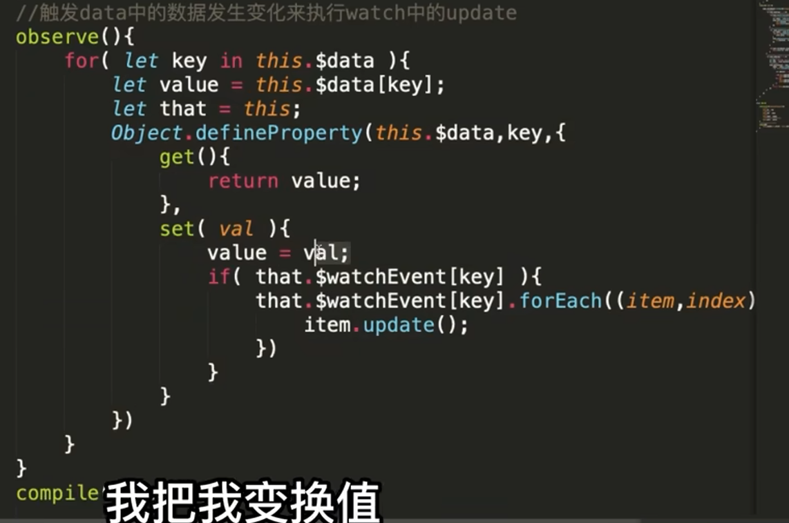

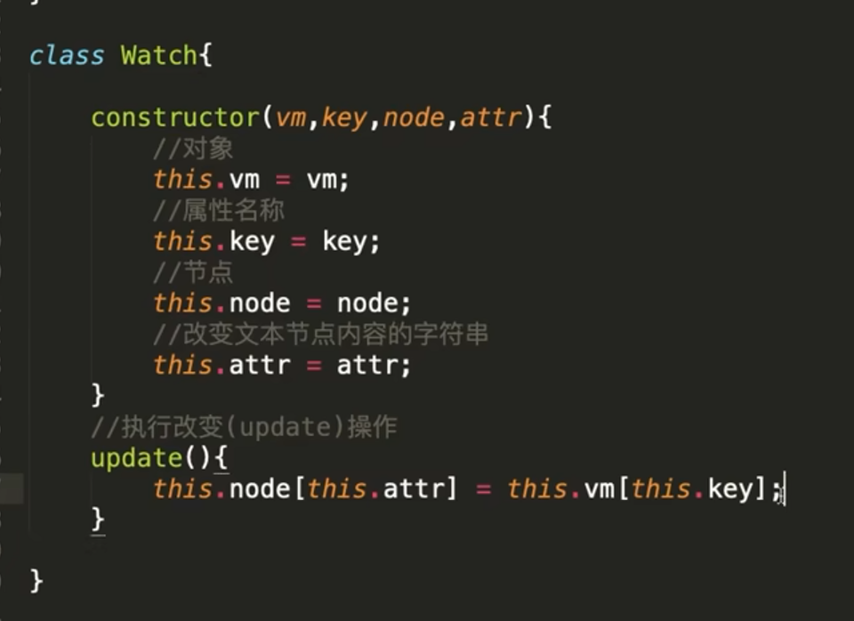

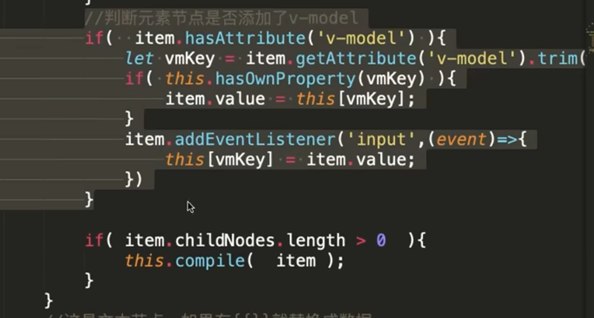

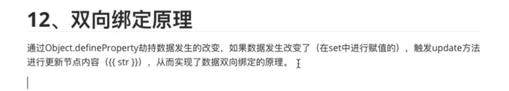

1、vue会遍历此data中对象所有的属性

2、并使用Object.defineProperty把这些属性全部转为getter/sett
ter

3、而每个组件实例都有watcher对象,

4、它会在组件渲染的过程中把属性记录为依赖

5、之后当依赖项的setter被调用时,会通知watcher重新计算,从而致使它关联的组件得以更新

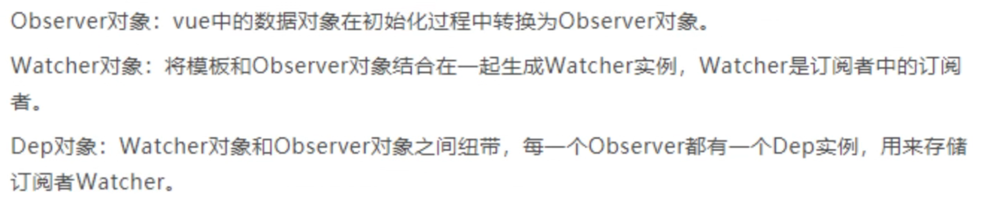

当属性变化会执行主题对象,Observer的dep.notify方法,这个方法会遍历订阅者Watchel
r列表向其发送消息,Watcher会执行run方法去更新视图。模板编译过程中的指令和数据绑定都会生成Watcher实例,实例中的watch属性也会生成Watcher实例

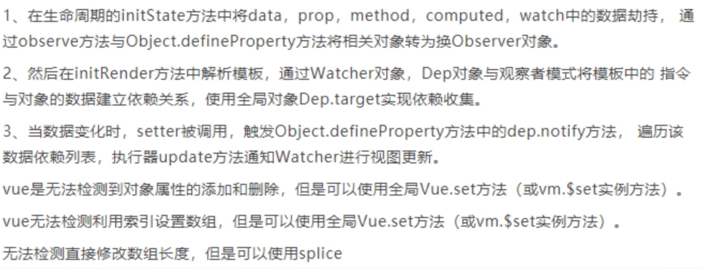

订阅者

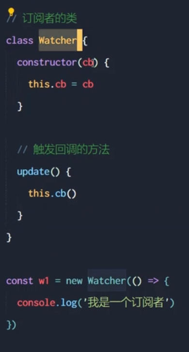

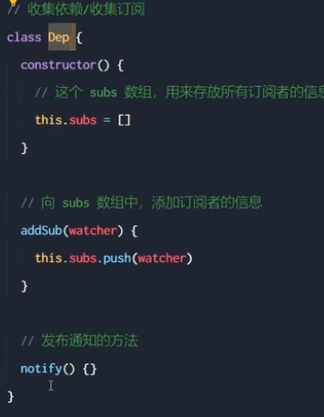

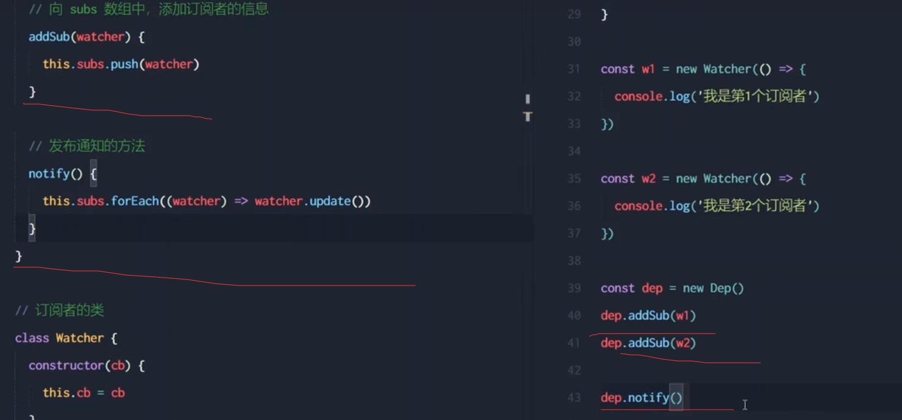

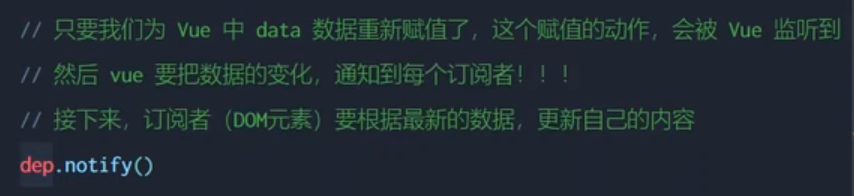

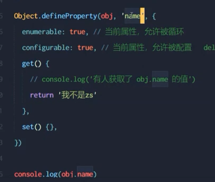

## Mounted

mounted是vue中的一个钩子函数，一般在初始化页面完成后，再对dom节点进行相关操作。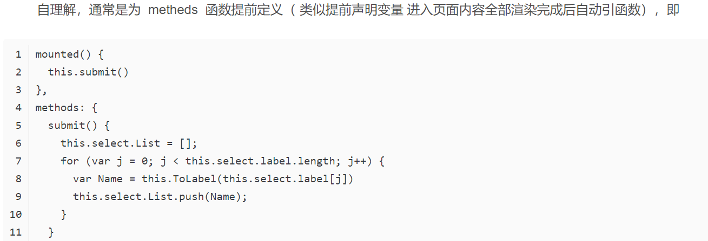

vue2使用挂载元素的outerHtml作为template，并替换元素，vue3使用挂载元素的innerHTML作为template，并且只替换挂载元素的子元素

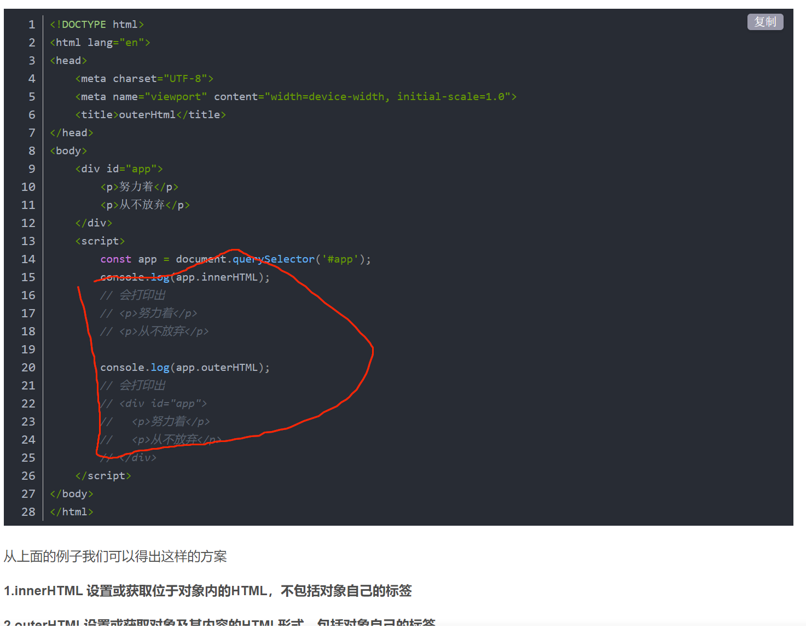

## vue模型与视图

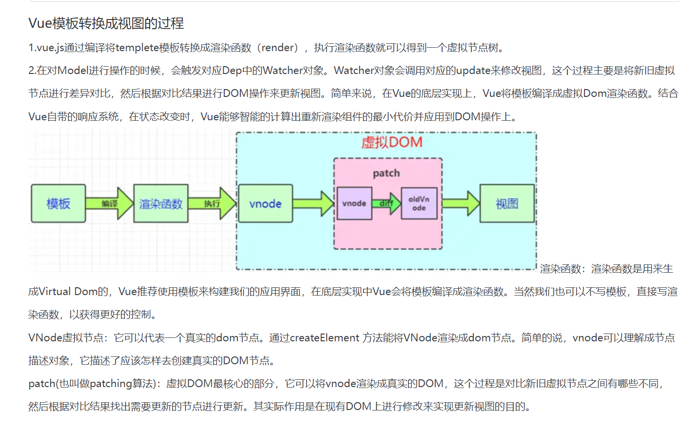

## v-bind与v-model

单向：数据只能从data流向页面  双向:数据只能从data流向页面

## vue组件

**全局，局部**

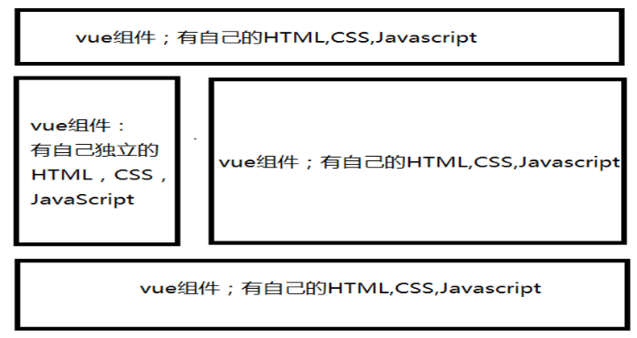

global-component-a></global-component-a

## 组件通信

1.**props和$emit**. 父->子组件传递数据是通过prop传递的，子->父组件是通过$emit触发事件来. 

2.$parent,$children3.$attrs和$listeners A->B->C。Vue 2.4开始提供了$attrs和$listeners来解决这个问题

3.父组件中通过provide来提供变量，然后在子组件中通过inject来注入变量。

4.$refs获取实例

5.envetBus平级/跨级组件数据传递这种情况下可以使用**中央事件总线**的方式。

6vuex状态管理

## **vuex**

形象的说是一个数据共享仓库，用于在组件关系复杂的情景下也能轻松地进行组件间数据通信。官方的说法是 “一个专为 Vue.js 应用程序开发的状态管理模式，用于集中式存储管理应用的所有组件的状态”。

**State：**通过 this.$store.state 拿到公共状态数据. 组件之间的状态、⾳乐播放、登录状态、加购物⻋等。

**vuex刷新**

会丢失，因为js的数据->浏览器的堆栈内存中->刷新浏览器页面，以前堆栈申请的内存就被释放

处理办法：

**1.异步请求后台数据。**页面刷新的时候异步请求后台数据，然后动态更新vuex中的数据。但是当网络延迟、数据量大时，还没有等vuex获取到后台返回的数据，页面就已经加载完成了，这样就会造成数据丢失。

2.**监听浏览器刷新前事件onbeforeunload，在浏览器刷新前将vuex数据保存在sessionStorage中**，刷新成功后，如果异步请求数据还没有返回直接获取sessionStorage中的数据，否则回去vuex中数据

## 虚拟dom/diff

虚拟dom是一个普通对象，它是描述真实dom的js对象，它至少会包含tag属性(描述当前节点是一个什么元素)，VNodeData属性(描述当前节点有哪些属性)，VNodeChildren属性(描述当前节点有哪些子节点，特殊子节点为innerTest)，虚拟dom可以使用render方法的形参createElement方法来创建得到。

**数据改变→>虚拟DOM(计算变更)→>操作真实的Ow→>视图更新**

- 真实dom：查找1000个节点，1000次赋值，1000次渲染；
- 虚拟dom会合并赋值和查找动作一次性赋值，(1000js对象查找，1000js赋值)，1次渲染

diff:遍历新旧虚拟树，同一层级 比较 标签名、key值，如果两个值都一样，则认为是同一个节点。以此类推比较下一层级。发现有不同，则进行更新属性。

## dom/diff

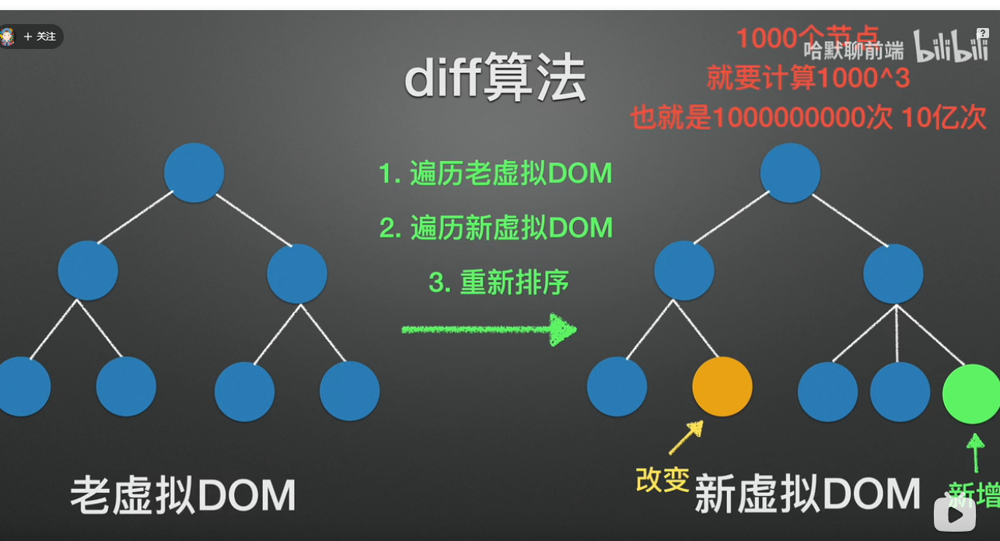

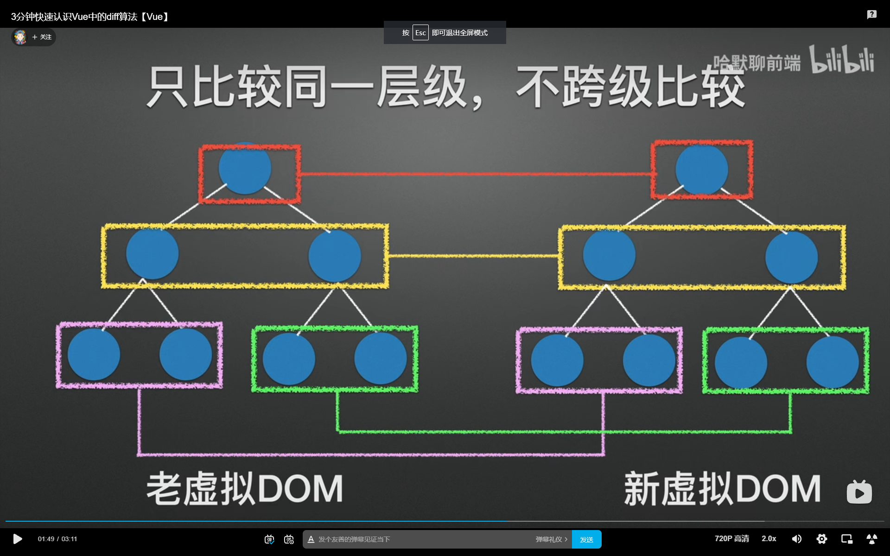

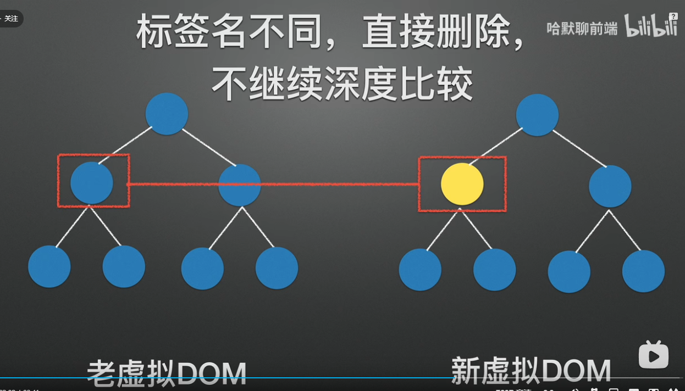

## 单页面(SPA） 

只有一张Web页面的应用，是一种从Web服务器加载的富客户端，单页面跳转仅刷新局部资源 ，公共资源(js、css等)仅需加载一次,但时间长，不利于搜索引擎优化(SOE)。

- 优点： 1、具有桌面应用的即时性、网站的可移植性和可访问性 2、用户体验好、快，内容的改变不需要重新加载整个页面 3、良好的前后端分离，分工更明确.
- 缺点： 1、不利于搜索引擎的抓取 2、首次渲染速度相对较慢。

## vue-router

更新视图但不重新请求页面，vue-router有两种模式：hash和history

（1）hash模式
hash虽然出现在url中，但是不会被包括在http请求中，因此该hash不会重载页面，每改变一次hash都会在浏览器的访问记录中添加一个记录

（2）history模式
主要依赖于pushState、replaceState来操作浏览器历史记录栈，调用这两个方法修改历史信息，虽然改变了url，但是浏览器不会立即发送请求该url

hash模式和history模式的区别：
1、history是利用浏览历史记录栈的 API实现，hash是监听location对象hash值的改变来实现
2、相同的url，history会触发添加到浏览器历史记录栈中，hash不会
3、在history模式下，如果服务器中没有相应的响应或者资源，会出现404错误

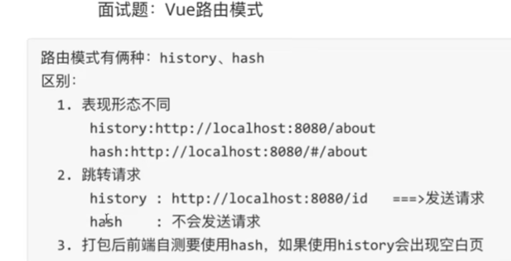

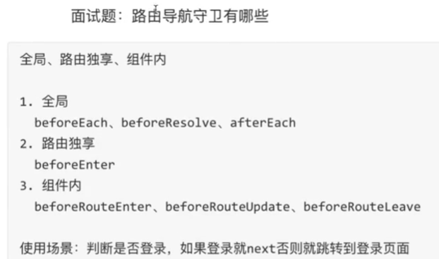

to，from,next

## 导航守卫

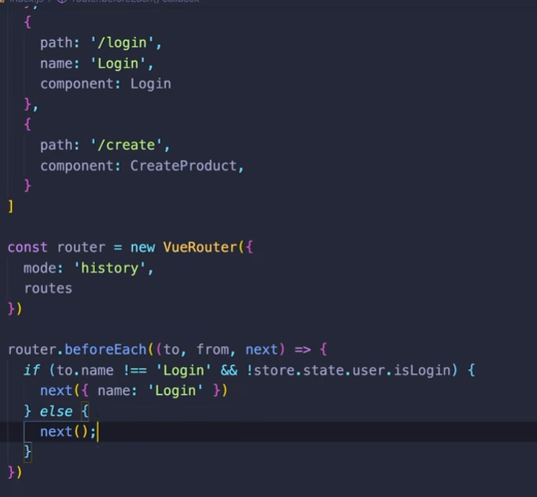

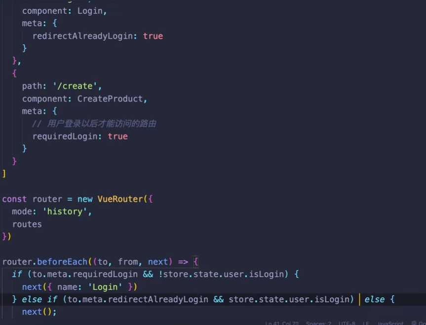

## 路由懒加载

***一开始进入页面时不需要一次性把资源都加载完，需要时在加载对应的资源***。路由对应的组件打包成一个个的js代码块。只有在这个路由被访问到的时候，才会加载对应组件的代码块。1.Vue异步组件2.ES6的import()3.webpack的require.ensure() 

**vue-lazyload**,获取视口的底部位置->**img.src-data-src**->收集所有的img.dom 对象->监听scroll事件->判断img.top值是否在视口内，是则data-src=src，加载

## 动态路由

addRoutes

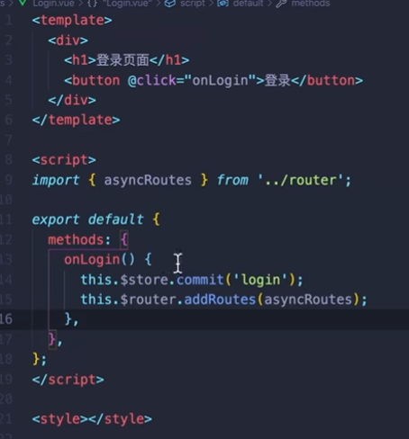

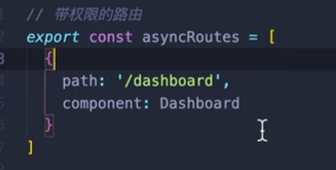

## v-text、v-html、v-model

- v-text：纯文本，单向绑定，会清空原有文本，而{{}}不会。
- v-html:里面可以传入html文本，会清空原有文本，
- v-model:双向绑定

## mutations VS actions

同步，异步

## computed VS watch

1.computed是计算属性；watch是监听，监听data中的数据变化。

2、computed支持缓存，当其依赖的属性的值发生变化时，计算属性会重新计算，反之，则使用缓存中的属性值；watch不支持缓存，当对应属性发生变化的时候，响应执行。

3、computed不支持异步，有异步操作时无法监听数据变化；watch支持异步操作。

4、computed第一次加载时就监听；watch默认第一次加载时不监听。

5、computed中的函数必须调用return；watch不是。

## Proxy和Reflect

通过Proxy创建原始对象的代理对象，从而在代理对象中使用Reflect达到对于js原始操作的拦截

## 修饰符

**1.表单2.事件.3.按键4.鼠标5.其他**

**表单**

- 1 lazy ,在失去焦点或者按下回车键时才更新; 
- 2 trim过滤首尾空格;.
- 3 number自动将用户的输入转为数值类型，如果您先输入数字，那么就会限制您输入的是数字，如果您先输入字符串，那么number修饰符无效；

**事件**

- ​	1.stop阻止冒泡排序。
- 2.prevent阻止默认行为;比如点击链接会进行跳转;
- 3 capture当捕获存在时，先从外到里的捕获，剩下的从里到外的冒泡输出.
- 4 self只当事件是从侦听器绑定的元素本身触发时才触发回调。
- 5 once,只触发一次回调

**按键**

​	left向左键.right向右键.up向上键.down向下键.enter回车键.tab制表键.delete 含delete和backspace键.csc返回键.space空格键
​       **鼠标**

​	 left只当点击鼠标左键时触发 .right 只当点击鼠标右键时触发.middle只当点击鼠标中键时触发测试

**其他**

​	ctrl.alt.shift .meta: 也叫win键，就是能打开windows菜单的键(mac中的cmd键)

## ESLint

是一个QA工具，用来避免低级错误和统一代码的风格，ESLint的主要用途：1审查代码是否符合编码规范和统一的代码风格；2.是否存在语法错误

## template

**template的作用是模板占位符，可帮助我们包裹元素，但在循环过程当中，template不会被渲染到页面上**

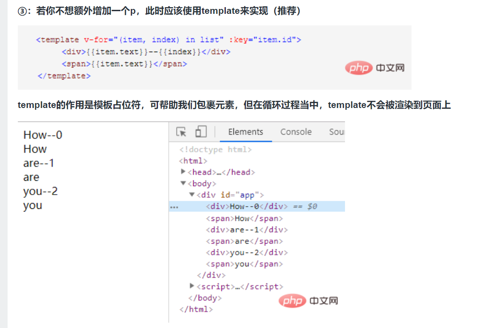

# CSS

## flex

flex-direction: 指定了弹性容器中子元素的排列方式， row | row-reverse | column | column-reverse

justify-content flex-start | flex-end | center | space-between | space-around

align-items  flex-start | flex-end | center | baseline | stretch

flex-wrap :换行 nowrap|wrap|wrap-reverse|initial|inherit;

align-content ：flex-start | flex-end | center | space-between | space-around | stretch

order:越小越前

flex：定义容器的占比

align-self:自身在侧轴上的对齐方式

## position

- [static](https://www.runoob.com/css/css-positioning.html#position-static)：默认
- relative：相对于正常元素的定位，占位置
- fixed:固定
- absolute:与相对于最近的已定位父元素，无则，那么它的位置相对于<html>。
- sticky:依赖于用户的滚动，在 **position:relative** 与 **position:fixed** 定位之间切换

z-index：重叠

## 布局方式

- **静态布局**，单位为像素
  - Float 布局
  - 绝对布局
- **自适应布局**
- **流式布局(又别名 百分比布局 %)**,单位未为%
  - 左侧固定+右侧自适应
  - 左右固定宽度+中间自适应
  - 圣杯布局
  - 双飞翼布局
- **响应式布局：依靠CSS媒体查询**
- 弹性布局 (rem/em flex布局)
- 网格布局

## 垂直居中的方式

- [1、设定行高(line-height)](https://blog.csdn.net/c_x_m/article/details/123274543#1lineheight_2)：父容器高度和子元素`line-height`一样的数值，内容中的行内元素就会垂直居中。
- [2、设置伪元素::before](https://blog.csdn.net/c_x_m/article/details/123274543#2before_28)：给父元素添加一个伪元素`::before`，让这个伪元素的`div`高度为`100%`，这样其他`div`就可垂直居中了，但`div` 本身就是块级元素，而`vertical-align`是行内元素属性，则需要修改为`inline-block`。
- [3、absolute + transform](https://blog.csdn.net/c_x_m/article/details/123274543#3absolute__transform_63) ：在父元素中设置相对定位`position: relative`，子元素设置绝对定位 `position: absolute`；top和left相对父元素的`50%`，与其搭配的 `transformse: translate(-50% , -50%)`表示`X轴`和`Y轴`方向水平居中。
- [4. 设置绝对定位 ](https://blog.csdn.net/c_x_m/article/details/123274543#4__94) 子元素绝对定位`position:absolute`,父元素相对定位`position: relative`，将上下左右的数值都设置为`0`，同时`margin:auto`。绝对定位是会脱离文档流的，这点要注意一下。
- [5、设置display:flex](https://blog.csdn.net/c_x_m/article/details/123274543#5displayflex_127)：给父元素设置`display: flex`布局，水平居中 `justify-content: center`，垂直居中`align-items: center`。
- [6、absolute + calc](https://blog.csdn.net/c_x_m/article/details/123274543#6absolute__calc_156) ：父元素`position`定位为`relative`，子元素`position`定位为`absolute`。水平居中同理。`calc`居中要减多少要结合到自己的宽高设置多少再进行计算。
- 7. display:table-cell：将父元素设置`display:table`，子元素`table-cell`会自动撑满父元素。组合 `display: table-cell、vertical-align: middle、text-align: center`完成水平垂直居中。

https://blog.csdn.net/c_x_m/article/details/123274543

## CSS优先级

!importat>行内样式（1000）>ID选择器（100）>类,伪类和属性选择器（10）>标签选择器（1）>通用选择器（0）

## 行元素与块元素

行元素:在一行水平排列，长高度就是元素长高度 display:inline，margin和padding如margin-left、padding-right可以产生边距效果

块:占整行，可以设置宽高，默认情况下宽度自动填满其父元素宽度、可以设置margin，padding，display:block

**display：inline-block** 可以让元素具有块级元素和行内元素的特性：既可以设置长宽，可以让padding和margin生效，又可以和其他行内元素并排。是一个很实用的属性。

# html

## 攻击

1. **Xss攻击**：跨站脚本攻击，它允许恶意web用户将代码植入页面中，这样当别人访问到该页面时，也执行了嵌入的那部分代码，可以简单的理解JavaScript代码注入
   - 防御：转义用户的输入，就是把用户的输入解读为数据而不是代码，对用户的输入及请求都进行过滤检查，设置输入域的匹配规则等，使用cookie的httpOnly属性，加上这个属性的cookie字段，js就无法进行读写了
2. **CSRF攻击**：跨站请求伪造，是一种对网站的恶意利用。比如说你登录了一个普通网站，然后CSRF攻击者在你已经登录目标网站之后，诱使你访问一个恶意网站，那个恶意网站就可能会冒充你的身份来进行一些操作。
   - 防御：
     - 1、重要的数据采用post进行接收，
     - 2、验证http referer字段，该字段记录了此次http请求的来源地址，
     - 3、使用验证码，只要涉及到数据交互就先进行验证码验证）
3. **DNS劫持**：域名劫持，劫持请求，分析请求的域名，只把在要劫持的域名请求名单之外的请求放行，否则返回假的IP地址或者什么都不做，这样就会失去响应，其效果就是对特定的网络不能访问或访问的是假网址。
   - 防御：比如说，我们经常会在各种饭馆里面连一些wifi，此时WiFi就是中间代理，如果这个wifi是黑客所建立的热点wifi，那么黑客就可以截获该用户收发的所有数据。所以建议网站都使用https进行加密，这样就算网站的数据能被拿到，黑客也无法解开。

## 缓存

- 客户端向服务器发起请求时，会根据HTTP响应头的字段加载缓存的资源。
- **http 缓存从第二次开始**。第一次请求从服务器加载所有资源，第二次请求浏览器根据响应头的字段加载缓存资源。
- http 缓存分为 **强缓存** 与 **协商缓存**。**无论是命中哪个缓存资源都是从客户端本地加载，不同的是协商缓存会向服务器发起请求，强缓存不会向服务器发起请求。**

**强制缓（**Cache-Control）存在客户端本地，请求直接从本地缓存中加载，不去请求服务器，返回的状态码是 200。

**协商缓存（Etag）**：请求的资源通过资源标识与服务器协商比对，协商成功，服务器返回304状态码，浏览器从本地加载。Etag 是 HTTP 响应头中的字段，Etag 的值是根据资源内容编码生成的一段字符串（资源标识），内容不同就会生成不同的Etag。再次发起请求时，请求头会带有 `if-none-match` 字段，值为上一次响应的 Etag（没有则不会携带）。服务器会将请求的资源生成资源标识与发送过来的值进行比对，比如果比对成功则返回 304 状态码，浏览器从本地加载该资源。

**优点：** 1. 减少请求的个数  2. 节省带宽，避免浪费不必要的网络资源  3. 减轻服务器压力。4. 提高浏览器网页的加载速度，提高用户体验

浏览器缓存分为：**内存缓存**(memory-cache)、**硬盘缓存**(disk-cache)

1. 强缓存
       1. 不会向服务器发送请求，直接从本地缓存中获取数据
       2. 请求资源的的状态码为: 200 ok(from memory cache)

2. 协商缓存
       1. 向服务器发送请求，服务器会根据请求头的资源判断是否命中协商缓存
       2. 如果命中，则返回304状态码通知浏览器从缓存中读取资源

3. 强缓存 & 协商缓存的共同点

          1. 都是从浏览器端读取资源

4. 强缓存 VS 协商缓存的不同点
       1. 强缓存不发请求给服务器

      2. 协商缓存发请求给服务器，根据服务器返回的信息决定是否使用缓存

         

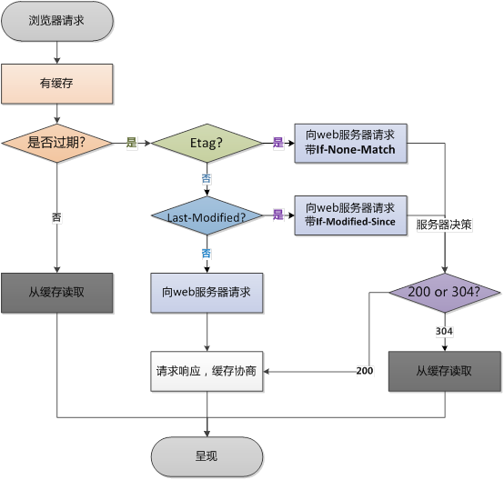

## 加密

**对称加密**：同一个秘钥，所以叫对称加密。DES, AES, 3DES
加密: 原文+密钥 = 密文
解密：密文-密钥 = 原文

**非对称**：加密和解密使用不同的秘钥，一把作为公开的[公钥](https://so.csdn.net/so/search?q=公钥&spm=1001.2101.3001.7020)，另一把作为私钥。RSA,ECC

**MD5**

用于密码加密:**消息摘要算法**(MD5 Message-Digest Algorithm),一种被广泛使用的**密码散列函数**，可以产生出一个128位（16字节）的散列值（[hash](https://so.csdn.net/so/search?q=hash&spm=1001.2101.3001.7020) value），用于确保信息传输完整一致。一种**不可逆的加密算法**，不可逆加密算法的特征是加密过程中不需要使用密钥，输入明文后由系统直接经过加密算法处理成密文，这种加密后的数据是无法被解密的，只有重新输入明文，并再次经过同样不可逆的加密算法处理，得到相同的加密密文并被系统重新识别后，才能真正解密。

## html渲染

1. 用户输入url地址，浏览器根据域名寻找IP地址
2. TCP连接
3. 浏览器向服务器发送http请求，如果服务器段返回以301之类的重定向，浏览器根据相应头中的location再次发送请求
4. 服务器端接受请求，处理请求生成html代码，返回给浏览器，这时的html页面代码可能是经过压缩的
5. 浏览器接收服务器响应结果，如果有压缩则首先进行解压处理，紧接着就是页面解析渲染

　　解析渲染该过程主要分为以下步骤：

1. 解析HTML
2. 构建DOM树
3. DOM树与CSS样式进行附着构造呈现树
4. 布局
5. 绘制
6. TCP断开

## 观察者与发布订阅

1.订阅-发布是观察者模式的一个变种。
2.观察者模式中主体和观察者是互相感知的，发布-订阅模式是借助第三方来实现调度的，发布者和订阅者之间互不感知
3.订阅-发布，观察者只有订阅了才能接受到被观察者的消息，同时观察者还可以取消接受被观察者的消息，也就是说在观察者和被观察者之间存在-个经纪人Broker来管理观察者和被观察者。

## sessionStorage、localStorage

**cookie**:大小限制，一般用于用户识别，一个请求一个cookie,且还需要指定作用域，不可跨越调用

都存储数据，会话，只存在当前的浏览器标签页，单页面开发；永久性存储，存储在电脑本地，单多页面开发

## webpack

 webpack是一个打包模块化js的工具，在webpack里一切文件皆模块，通过loader转换文件，通过plugin注入钩子，最后输出由多个模块组合成的文文件，webpack专注构建模块化项目。**webPack可以看做是模块的打包机器**：它做的事情是，分析你的项目结构，找到js模块以及其它的一些浏览器不能直接运行的拓展语言，例如：Scss，TS等，并将其打包为合适的格式以供浏览器使用。件，webpack专注构建模块化项目。        

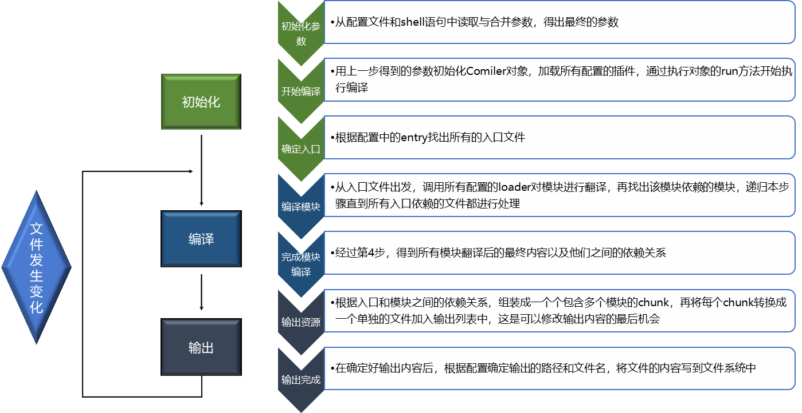

**`plugin` 是用来扩展 webpack 功能的，通过在构建流程里注入钩子实现**。*插件机制就是为了完成项目中除了资源模块打包以外的其他自动化工作,解决上述的问题。*

**plugin 相对于 loader 有哪些区别？**

`loader` 是转换器，将一种文件编译转换为另一个文件，操作的是文件。例如：将 `.less` 文件转换成 `.css` 文件。

`**plugin**` 是**扩展器**，它是针对 `loader` 结束之后，**打包的整个过程**。它并不直接操作文件，而是**基于事件机制工作**。在 webpack 构建流程中的特定时机会广播对应的事件，插**件可以监听这些事件的发生，在特定的时机做对应的事情**。包括：打包优化，资源管理，注入环境变量。

## 前端页面优化

首先前端[性能指标](https://so.csdn.net/so/search?q=性能指标&spm=1001.2101.3001.7020)一般分为以下几种：

首次显示渲染元素的**白屏时间**： ***\*FCP\****
首屏全部渲染的**首屏时间**：LCP 是 FSP 的近似值；

- 首屏绘制（First Paint，FP）
- **首屏内容绘制（First Contentful Paint，FCP）**
- 可交互时间（Time to Interactive，TTI）
- **最大内容绘制（Largest Contentful Paint，LCP)**
- 首次有效绘制（First Meaning Paint, FMP）

FP 是时间线上的第一个“时间点”，是指浏览器从**响应**用户输入网址地址，到浏览器开始显示内容的时间，简而言之就是浏览器第一次发生变化的时间。

**FCP是指浏览器从响应用户输入网络地址，在页面首次绘制文本，图片（包括背景图）、非白色的 canvas 或者SVG 才算做 FCP**

TTI，翻译为“可交互时间”表示网页第一次完全达到可**交互**状态的时间点。可交互状态指的是页面上的 UI 组件是可以交互的（可以响应按钮的点击或在文本框输入文字等），不仅如此，此时主线程已经达到“流畅”的程度，主线程的任务均不超过50毫秒。在一般的管理系统中，TTI 是一个很重要的指标。

FMP（全称“First Meaningful Paint”，翻译为“首次有效绘制”表示页面的“主要内容”开始出现在屏幕上的时间点，它以前是我们测量用户加载体验的主要指标。本质上是通过一个算法来猜测某个时间点可能是 FMP，但是最好的情况也只有77%的准确率，在lighthouse6.0 的时候废弃掉了这个指标，取而代之的是 LCP 这个指标。

**LCP（全称“Largest Contentful Paint”）表示可视区“内容”最大的可见元素开始出现在屏幕上的时间点。**

## 状态码

TCP

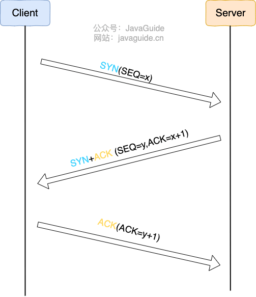

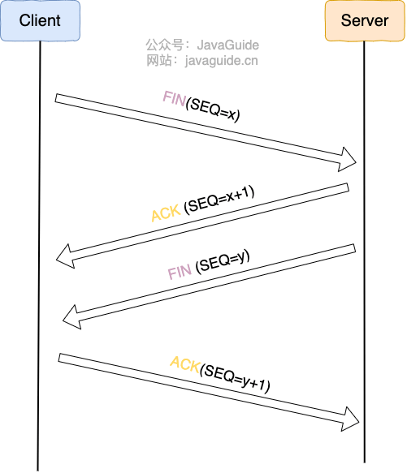
